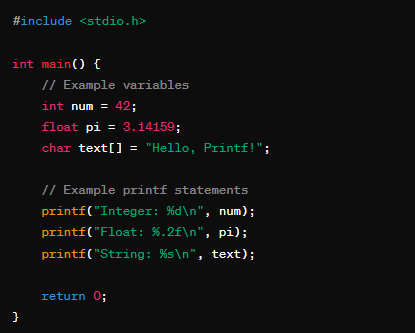
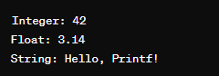

# Printf Function Implementation

## Screenshot

Input:

Output:

## About the Developer

Hi there! I'm [Your Name], a passionate software developer with a love for creating efficient and reliable code. You can find more about me on my [LinkedIn](https://www.linkedin.com/in/your-name/) profile. I frequently share my thoughts and updates on Twitter [@YourTwitterAlias](https://twitter.com/your-twitter-alias). Check out my diverse portfolio on [GitHub](https://github.com/your-username) for more exciting projects.

## Project Description

Welcome to my Printf Function implementation project! This project is a comprehensive implementation of the printf function in C, offering a flexible and extensible way to format and print text. The printf function is a fundamental part of the C programming language, and this project aims to provide a clean and efficient version with added features.

### Features

- **Basic Formatting**: Support for basic format specifiers like `%s` for strings, `%d` for integers, `%f` for floating-point numbers, etc.
- **Width and Precision**: Customize the width and precision of the output for more control over the formatting.
- **Modifiers**: Implementing modifiers such as flags and length modifiers to enhance the versatility of the printf function.

### Project Development Story

The journey of developing this printf function has been an exciting and challenging experience. Starting with the basic formatting, I gradually expanded the functionality to cover a wide range of format specifiers and modifiers. The process involved thorough testing and debugging to ensure the reliability and accuracy of the output.

### Implemented Features vs. To Be Implemented

**Implemented Features:**
- Basic format specifiers
- Width and precision customization
- Modifiers like flags and length modifiers

**To Be Implemented:**
- Additional format specifiers (e.g., `%c` for characters)
- Advanced formatting options
- Error handling and edge cases

### Challenges Encountered

One of the most challenging aspects of this project was dealing with the precision and width modifiers. Ensuring that the function handled various input scenarios and produced the expected output required meticulous attention to detail. Additionally, managing memory allocation for different data types presented some complexities that needed careful consideration.

I am committed to enhancing this printf function further and addressing any potential issues. Feel free to contribute or provide feedback to make this project even better!

Thank you for checking out my Printf Function Implementation project! If you have any questions or suggestions, don't hesitate to reach out. Happy coding!

